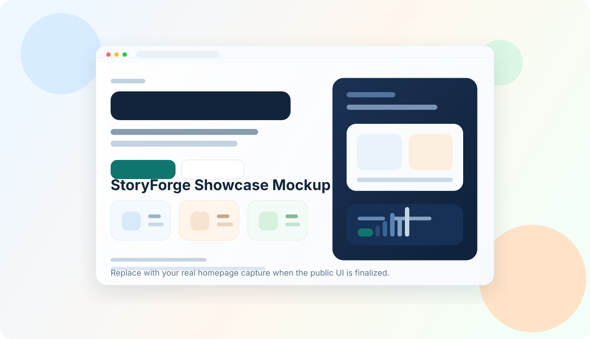
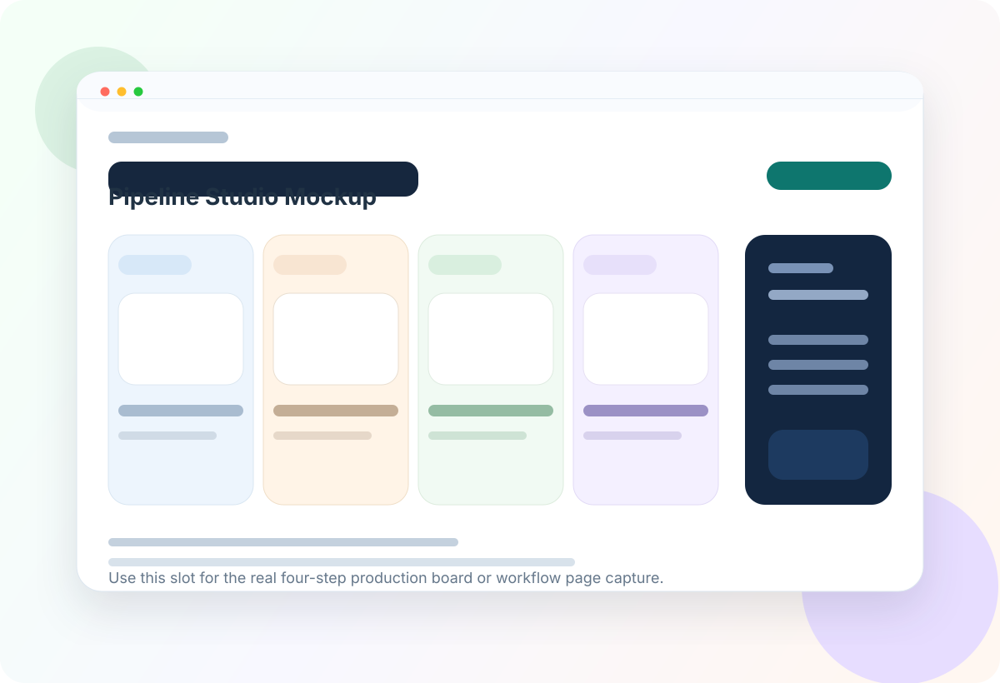

# StoryForge

<p align="left">
  
  
  
  
  
  
  
  
  
</p>

<p align="left">
  <strong>Agentic fiction-to-video workflow for turning a story brief into a novel, character art, scene frames, and video clips.</strong>
</p>

<p align="left">
  StoryForge is built for creator tools, prototype studios, and narrative production pipelines that need structured outputs, staged execution, and reviewable media assets instead of one-shot prompts.
</p>

StoryForge 是一个面向“小说生成 + 小说转视频”的工程化工作流系统。它把大模型生成、角色设定、生图、生视频、任务编排和产物管理串成了一条可运行的生产链路，而不是单个 prompt 的演示脚本。

当前版本支持：

- 基于 `LangChain >= 1.2` 的结构化多 Agent 小说生成
- 基于 `DeepSeek` 与 `ChatGPT 5.4` 的双 LLM 接入，页面可切换
- `chapter -> scene -> chunk -> segment` 四层视频规划结构
- `project.segment_contracts` 按 chapter / scene / chunk 持续写入 checkpoint，支持失败位置回传和从失败位置继续
- `story_memory.json` 保存章节级承接、角色关系、环境锚点和固定道具状态
- `scene_plan.json` 保存 scene 结构、`scene_bible`、`covered_event_ids`、`covered_event_summaries` 与跨 scene 过渡合同
- `segment_plan.json` 保存逐段执行索引、`shot_state`、`continuity_link`、首帧 / 中段 / 尾帧 prompt 和音频字幕字段
- `scene_master_frame` 作为无角色空场景母图，锁定同一 scene 的背景环境、光线、固定道具和空间透视
- 基于 `Doubao Seedream 4.5` 的角色定妆图、场景母图和 segment 关键帧生成
- 基于 `Seedance 2.0` 的多模态参考图视频片段生成、下载与 `ffmpeg` 合并
- 连续性审校与合同修复：规则审校、可选 LLM 软审校、segment 修复、scene 修复和批量风险合同修复
- `FastAPI` + 异步任务队列 + MySQL 项目 / 任务持久化
- 浏览器端六步式工作台 + HTTP API；CLI 提供服务启动入口

## 核心工作流

StoryForge 默认采用六阶段后台任务流：

1. 生成小说正文
2. 生成场景结构
3. 生成分段合同
4. 生成角色图
5. 生成场景图
6. 生成视频

页面在第 1 步和第 2 步之间展示并允许编辑 `story_source`。分段合同阶段会持续回写 `segment_contract_progress`，后端按 chapter / scene / chunk 写入 checkpoint；失败后可直接从失败位置继续。视频合并是可选手动动作。

## 主要特性

- 结构化多 Agent 小说生成链路：`Story Architect`、`Story Drafter`、`Cast Analyzer`、`Character Designer`、`Chapter Planner`、`Editorial Reviewer`
- 小说链路采用 story-first：先生成完整小说草稿并落成 `story_source.json`，再从这份可编辑正文里解析 cast、生成角色卡和结构化章节蓝图
- Web 工作台支持审阅并编辑生成后的小说正文；保存正文后，相关结构化结果和媒体资产会被标记为需要重做
- 场景工作台按 scene 展示场景基准、跨场过渡合同、空场景母图状态和片段矩阵，方便检查场景一致性与承接关系
- Web 创建页支持直接选择当前故事使用的 LLM provider；`模型 ID` 只读并自动跟随默认模型，内置 `DeepSeek` 与 `ChatGPT 5.4`
- 角色结构以 LLM `Cast Analyzer` 结果为主，优先依据小说正文抽取 cast slots；heuristics 负责规则校验、归一化与轻量 repair
- 小说结构化阶段在 live LLM 模式下采用 fail-fast：坏结构最多自动重试 3 次，失败原因会写入任务记录
- LangChain 结构化主链路按 provider 选择策略：`DeepSeek` 使用 `with_structured_output(method="function_calling", include_raw=True)`，`OpenAI / ChatGPT 5.4` 使用 `with_structured_output(method="json_schema", include_raw=True)`；structured 空返回会进入 plain JSON 回收
- LLM 配置包含 `llm.max_tokens`，默认 `8192`
- `story_memory` prompt 使用 `chapter_batch_view + recent_chapter_memory + focus_cast_bible`，scene / chunk planner 从正文抽局部聚焦摘录，控制长章节 prompt 长度
- 分步结构化阶段具备后端幂等保护：`project.scene_structure` 与 `project.segment_contracts` 按正文修订复用已有 queued / running / completed 任务
- 视频规划与执行解耦：先产出角色视觉档案、scene plan、segment plan、场景帧和 Seedance manifest，再决定是否提交真实媒体任务
- 视频规划分为场景主规划与执行索引：`scene_plan.json` 负责场景级结构与 `scene_bible`，`segment_plan.json` 负责逐段执行和重试
- 视频 segment 规划在 live LLM 模式下采用 fail-fast：分析模板、伪分镜、空结构、时长预算不匹配、关键帧角色不完整都会触发结构化重试或显式失败
- 角色一致性链路：角色定妆卡 -> 场景关键帧 -> 视频片段
- 场景一致性链路：`scene_bible` -> `scene_master_frame` -> 首帧 / 中段 / 尾帧 -> Seedance 参考图
- 镜头连续性链路：`shot_state` -> 关键帧 prompt -> Seedance 视频 prompt
- 跨段承接链路：`continuity_link` -> 首帧承接判断 -> 关键帧 prompt -> Seedance 视频 prompt
- Seedance 视频提交使用首帧 / 中段 / 尾帧三张时间锚点图；prompt 使用 `图片1 / 图片2 / 图片3` 绑定首帧、中段帧和尾帧，并按 `motion_plan` 分阶段写画面推进
- 连续性审校链路：`continuity_report.json` 汇总规则审校与可选 LLM 软审校，支持 `off / auto / on`
- 连续性修复链路：时间线高风险 scene 或 segment 可触发 `project.continuity_repair`，只回写目标范围合同和报告，媒体重跑由用户手动决定
- 项目详情时间线按 `scene` 分组展示多个 `segment`，连续片段可复用前一段尾帧作为下一段首帧
- 角色定妆图使用白底三视图模板：只显示角色姓名，生成正面 / 左侧面 / 背面
- 音频与字幕链路：对白、旁白、角色音色、环境音、音乐方向和硬字幕文案进入 Seedance prompt
- 项目级管理：支持同一项目下多次运行结果追踪
- 元数据持久化：基于 MySQL
- 页面展示任务和各阶段失败原因，便于定位 LLM schema、Seedream、Seedance 或下载失败
- 自动产物落盘：核心 JSON、图片、视频和执行报告保存到输出目录

## 代码结构

视频域当前模块职责：

- `src/storyforge/domains/video/service.py`：初始化、公开入口、主流程编排、逐章规划调度和 plan 后处理
- `src/storyforge/domains/video/chapter_orchestration.py`：章节事件规划、章节 scene 规划和 `chapter -> scene` 展开编排
- `src/storyforge/domains/video/chunk_orchestration.py`：scene chunk 规划、segment contract 规划、合同归一化、跨 chunk 承接状态和定向 repair 编排
- `src/storyforge/domains/video/chapter_event_validation.py`：章节事件覆盖、事件粒度、正文定位、章节正文读取和 targeted split 校验
- `src/storyforge/domains/video/structure_validation.py`：scene / chunk / transition 结构校验、角色视觉表校验、软放行与边界判定
- `src/storyforge/domains/video/segment_validation.py`：segment contract 与 segment plan 总体验证，包括时长预算、`timed_beats` 覆盖、关键帧语义距离、方向一致性和多人特写冲突
- `src/storyforge/domains/video/prompting.py`：planner prompt、media prompt、repair prompt 和共享规则块
- `src/storyforge/domains/video/repair.py`：LLM 输出修补、continuity repair 入口、repair report 组装、repair 结果校验和 plan 重建
- `src/storyforge/domains/video/enrichment.py`：首帧 / 尾帧本地 prompt、音效和音乐方向补全
- `src/storyforge/domains/video/materialization.py`：chapter scene、scene segment、帧角色校验、角色 profile、voice map、runtime scene / segment 与修复结果回写物化
- `src/storyforge/domains/video/planning.py`：默认推导、story memory、媒体任务构建、规划产物路径 / 读取与任务装配
- `src/storyforge/domains/video/structured_generation.py`：结构化 LLM 调用、重试循环、prompt metrics 注入和 response coercion
- `src/storyforge/domains/video/structured_retry_prompts.py`：结构化 retry 文案 builder 和按错误类型追加的修复提示
- `src/storyforge/domains/video/text_rules.py`：文本相似度、推进点、边界词、方向词等共用规则

## 技术栈

- Python `>= 3.11`
- `uv`
- `FastAPI`
- `Pydantic`
- `LangChain[openai] >= 1.2`
- `httpx`
- `PyMySQL`
- `ffmpeg`

默认模型配置：

- LLM：默认 `deepseek-chat`，可切换到 `gpt-5.4`
- Image：`doubao-seedream-4-5-251128`
- Video：`doubao-seedance-2-0-260128`

## 产品预览

下面这组图展示当前产品方向的静态 SaaS mockup，可替换为真实运行截图。

<p align="center">
  
</p>

<p align="center">
  
  
</p>

## 快速开始

### 1. 安装依赖

```bash
uv sync
```

### 2. 准备环境变量

```bash
cp .env.example .env
```

至少需要配置：

```bash
DEEPSEEK_API_KEY=...
DEEPSEEK_BASE_URL=...
SEEDREAM_API_KEY=...
SEEDANCE_API_KEY=...
SEEDREAM_BASE_URL=...
SEEDANCE_BASE_URL=...
```

如果你要在页面里切到 `ChatGPT 5.4`，还需要：

```bash
OPENAI_API_KEY=...
OPENAI_BASE_URL=https://api.openai.com/v1
```

注意：

- 页面里的 `模型 ID` 是只读默认值；如果后端平台不支持该模型，应改后端配置 / 平台映射，而不是在页面手动填写模型名

还必须配置 MySQL 密码：

```bash
STORYFORGE_DB_PASSWORD=...
```

### 3. 检查配置文件

默认配置文件是 [`configs/storyforge.example.toml`](configs/storyforge.example.toml)。
`configs/` 目录提供两份配置：

- [`configs/storyforge.example.toml`](configs/storyforge.example.toml)：主配置，默认开发与日常运行使用
- [`configs/storyforge.live.example.toml`](configs/storyforge.live.example.toml)：真实提交模板，适合需要默认自动提交 Seedream / Seedance 的场景

关键配置项包括：

- `llm.provider` / `llm.model`
- `llm.available_providers`
- `seedream.base_url` / `seedream.model`
- `seedance.base_url` / `seedance.model`
- `queue.concurrency`
- 内容合规由接入的 LLM / 媒体供应商负责，StoryForge 后端聚焦任务编排、数据持久化与产物管理

### 4. 启动 Web 控制台与 API

```bash
uv run storyforge api serve
```

启动后访问：

- `http://127.0.0.1:8000/`
- `http://127.0.0.1:8000/docs`

开发页面样式或前端模块时可以临时加 `--reload`。跑 Seedream / Seedance 这类长任务时不要使用 `--reload`，否则代码保存会触发服务热重载，中断正在执行的任务。

### 5. 按页面流程执行

1. 在页面创建故事并生成小说
2. 在“小说”标签页审阅并按需修改正文
3. 手动触发场景结构生成
4. 检查 `chapter -> scene` 结构后，再生成分段合同；分段合同内部按 scene chunk 执行
   - 如果分段合同在中途失败，页面会显示 `章 + scene` 进度和失败位置，可直接从失败位置继续
5. 查看 `scene` 分组后的时间线规划
6. 在同一条 story run 上生成角色图
7. 基于同一条 story run 逐段生成场景图与视频，并在需要时手动合并总片

## CLI

CLI 提供启动 Web / API 的入口：

```bash
uv run storyforge api serve
```

当前推荐工作方式统一为页面分步操作。

## API 概览

常用接口：

- `POST /v1/projects/novel`
- `POST /v1/projects/scene-structure`
- `POST /v1/projects/segment-contracts`
- `POST /v1/projects/characters`
- `POST /v1/projects/scenes`
- `POST /v1/projects/videos`
- `GET /v1/projects`
- `GET /v1/projects/{project_id}`
- `DELETE /v1/projects/{project_id}`
- `GET /v1/projects/{project_id}/story-source/{source_task_id}`
- `PUT /v1/projects/{project_id}/story-source/{source_task_id}`
- `GET /v1/tasks/{task_id}`
- `GET /v1/tasks/{task_id}/artifacts`

删除项目时，后端会同步清理项目元数据、任务记录和安全范围内的输出目录。

创建故事或一键全链路任务时，可以在请求体中附带：

- `llm_provider`: `deepseek` 或 `openai`
- `llm_model`: 例如 `deepseek-chat` 或 `gpt-5.4`
- `continuity_review_mode`: `off`、`auto` 或 `on`
完整字段、请求示例和阶段接口说明见：[docs/api.md](docs/api.md)

项目详情时间线支持查看并修改单个 segment 的首帧、中段、尾帧和 Seedance 视频 prompt。保存视频 prompt 后该段旧视频会失效，后续由用户手动重跑视频。

## 输出产物

核心产物包括：

- `story_source.json`
- `novel_package.json`
- `novel_audit.json`
- `story_memory.json`
- `scene_plan.json`
- `segment_plan.json`
- `seedream_character_execution.json`
- `seedream_scene_execution.json`
- `seedance_manifest.json`
- `seedance_execution.json`
- `rendered/*.mp4`
- `rendered/full_story.mp4`

项目任务产物默认落在 `outputs/<story-slug>/`，同一条 story run 会持续复用同一个 `output_dir`。
更完整的目录结构、产物职责和联调顺序见：[docs/usage.md](docs/usage.md)

## 仓库结构

```text
StoryForge/
├── configs/                 # 配置文件
├── docs/                    # 项目文档
├── examples/                # 示例 brief
├── src/storyforge/
│   ├── agents/              # Agent backend 抽象与 LangChain 实现
│   ├── api/                 # FastAPI、模板和静态资源
│   ├── application/         # 队列、任务运行时、持久化
│   ├── core/                # 配置、IO、环境变量工具
│   ├── domains/             # 小说 / 视频领域服务
│   ├── integrations/        # DeepSeek、Seedream、Seedance、ffmpeg
│   ├── pipelines/           # story / video pipeline
│   └── cli.py               # CLI 入口
├── tests/
├── .env.example
├── pyproject.toml
└── uv.lock
```

## 测试

运行静态检查：

```bash
uv run ruff check src/storyforge tests
```

运行测试：

```bash
uv run pytest
```

## 文档索引

- [使用文档](docs/usage.md)
- [API 文档](docs/api.md)
- [架构文档](docs/architecture.md)
- [开发文档](docs/development.md)
- [工程状态与路线图](docs/status.md)

## License

MIT
